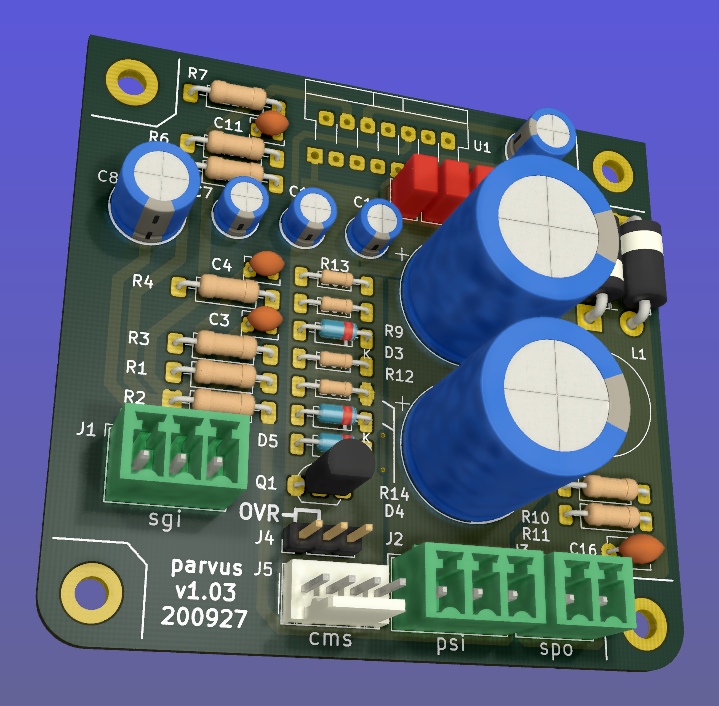
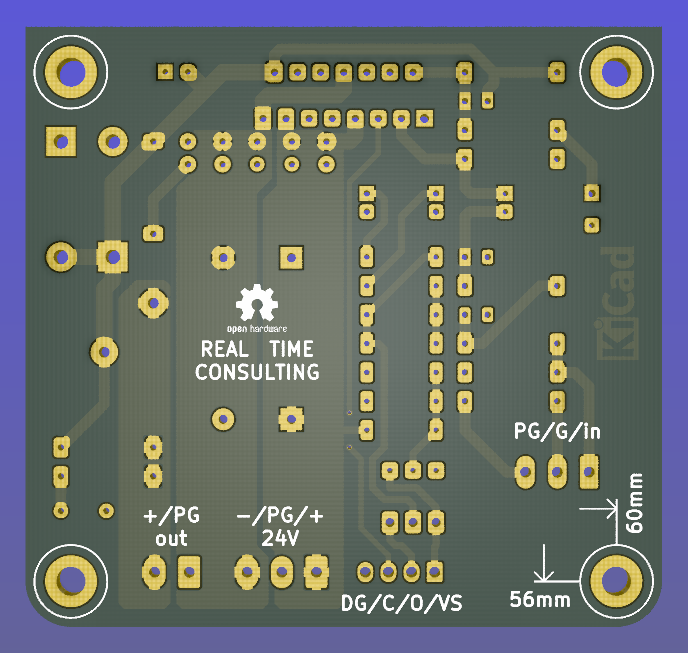
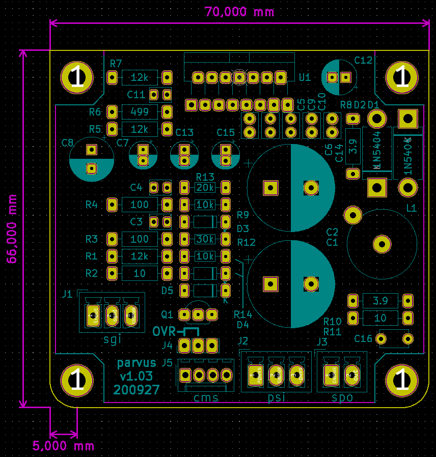

.. contents:: Table of Contents
   :depth: 3

Introduction
============

This document shall describe rationales used to design and build audio
power amplifier using TDA7293 integrated circuit.

Architecture
============

The amplifier architecture consists of the following sections:

The amplifier consists of the following section:
 - Amplifier (AMP) board (left and right channels)
 - Input/output filtering and Interface (IOI) board
 - Power supply and control (PSC) board
 


Each of these sections are implemented as a separate board.

Amplifier (AMP) board
=====================

Connections
-----------

The board features the following conntectors:

 - Power Supply Input - PSI: Vcc, GND, Vee
 - Speaker Output - SPO: Out, GND
 - Signal Input - SGI: In, SGND
 - Control and Mute Slave - CMS: Power sense, Mute, Clip, GND


3D Render with components
-------------------------



3D Render of board top layer
----------------------------


3D Render of board bottom layer
-------------------------------



PCB Silkscreen plan
-------------------



Schematic
---------

.. image:: images/schematic.png

Input low-pass filter
---------------------

For input filter we choose the frequency between 300kHz and 400kHz::

        +---+ Rlp1    +---+ Rlp2
    0---+   +----+----+   +---+---o Toward Amplifier IC block
        +---+    |    +---+   |
               ----- Clp1   ----- Clp2
               -----        -----
                 |            |
                === Ground   === Ground


Using the 2nd order CR low-pass filter calculator at URL:
*http://sim.okawa-denshi.jp/en/CRCRtool.php* we arrive at:

.. math::

    Rlp1 = 100 Ohm, Rlp2 = 100 Ohm

    Clp1 = 220pF,   Clp2 = 2.2nF

    fp1 = 352kHz

    fp2 = 14MHz


For more details please refer to: http://www.johnhearfield.com/RC/RC4.htm

The ground loop breaker resistor
--------------------------------

A ground loop breaker resistor is located between SGND and GNDPWR grounds. The
value of this resistor should be around 10 ohms.


Gain value
----------

Using inverted topology since we want to reduce common mode distortion in the
input stage. But in case of TDA7293 IC it is not easy to use inverted topology
since the mute circuit is implemented on positive OPAMP input.

The equivalent gain circuit resistance needs to stay below 600ohms. This is so
because all noise measurements in data-sheet were done with 600ohms or 0ohms.

Using low feedback gain is preferred for several reasons:
 * there is more loop gain available to reduce the distortion
 * reduced outout noues
 * lower offset at output

Nominal gain of an non-inverting amplifier is:

.. math::

    G=Rf/Rg+1

Since we have a voltage divider with same resistors in the front of the 
amplifier the total gain becomes:

.. math::

    G=Rf/Rg

The minimum gain specified in the TDA7293 datasheet is 26dB or 20 times. Just
to be on the safe side we choose 10% bigger value: 22

Chosen values for E24 series:
 * Rf = 12kOhm
 * Rg = 510 Ohm

Chosen values for E48 series:
 * Rf = 11kOhm
 * Rg = 499 Ohm


Frequency compensation
----------------------

The TDA7293 data-sheet does not provide enough of relevant data in order to
model the IC in AC domain. Since we can't model it there are no optimizations
available for the negative feedback circuit. But we can safely assume that
there are high frequency poles present in the TDA7293 transfer function. For
this reason we will add a few ``pF`` to calculated lead compensation
capacitor below (see ``Cadd``).

Lead compensation
^^^^^^^^^^^^^^^^^

Equivalent feedback network with lead compensation circuit::

          o Vout
          |
          *------+
          |      |
         +-+ Rf  |
         | |   ----- Cf=Cl (+Csi, see Input pin capacitance compensation)
         | |   -----
         +-+     |
   Vf     |      |
    o-----*------+
          |
         +-+ Rg
         | |
         | |
         +-+
          |
          o Input

Resistors `Rf` and `Rg` are part of feedback network. Capacitor `Cf` is the
compensation capacitor. The transfer function of this network is given as:

.. math::

    Vf(s)=I(s)*Rg

    Vout(s)=I(s)*(Rf||Cl + Rg)=I(s)*(Rf/(1+s*Rf*Cl)+Rg)

    H(s)=Vf(s)/Vout(s)=(Rg/(Rf+Rg))*((1+s*Rf*Cl)/(1+s*Re*Cl))

Zero:

.. math::

    wz=1/(Rf*Cl)

Pole:

.. math::

    wp=1/(Re*Cl)

Where:

.. math::

    Re=Rf||Rg=Rf*Rg/(Rf+Rg)

Rough estimation is to put additional 1-3pF in parallel to ``Rf``.

.. math::

	Cadd = 3pF
	

Input pin capacitance compensation
``````````````````````````````````

Input pins have the following parasitic capacitances associated:

* Cdiff
* Cm
* Cstray

The TDA7293 data-sheet does not specify any parameter regarding parasitic
input capacitances. Voltage feedback OPAMPS usually have both differential and
common-mode input impedances specified. In the absence of any information, it
is safe to use the model given in the next figure::

                   +----+ Zdiff
    +input o---+---|    |---+---o -input
               |   +----+   |
               |            |
              +-+ Zcm1     +-+ Zcm2
              | |          | |
              | |          | |
              +-+          +-+
               |            |
              ===          ===

We can use a rough estimation of values based on experience on using other 
audio FET OPAMPS, and typical values are around ``Cdiff=5pF``, ``Cm=4pF`` 
and ``Cstray=3pF``. All three equivalent capacitors are tied in parallel, 
so the total input capacitance becomes:

.. math::

    Cinput = Cdiff+Cm+Cstray=5pF+4pF+3pF=12pF


To mitigate this capacitance we can add capacitance `Csi` parallel to `Rf`
resistor. To compensate for this the following equation is applied:

.. math::

    Rf*Cf=Rg*Cinput

    Csi=Cinput*Rg/Rf=0.5pF

The final ``Cf`` value is:

.. math::

    Cf=Cl+Csi+Cadd=0+2+0.5=2.5pF

Any NP0 based capacitor around ``3pF`` will be good for this purpose.

Input/output filtering and Interface (IOI) board
================================================

Input circuit
-------------

Input EMI suppression
^^^^^^^^^^^^^^^^^^^^^

To protect the input from EMI we will use the following Zobel network::

          o Positive input or negative input
          |
          |
        ----- Czi
        -----
          |
          |
         +-+  Rzi
         | |
         | |
         +-+
          |
         === Ground

For most input cables characteristic impedance falls in range between
50 and 100ohm impedance and we are using the 75ohm as the middle value. The
resistor Rzi is ``Rzi=75ohm`` and the capacitor Czi is ``Czi=220pF``.
This network should be placed right at the input connector, not on the
main amplifier PCB.

Also, a 100n X7R capacitor shall be placed between SGND and chassis right at the
input connector. This capacitor will shunt radio and other interfirence signal
into the Chassis Ground potential.

Output circuit
--------------

Output EMI suppression
^^^^^^^^^^^^^^^^^^^^^^

Output network consists of upstream and downstream Zobel Network and of output
coil (``Ld``) with parallel, damping resistor (``Rd``). Upstream Zobel network 
provides a low-inductance load for the output stage at very high frequencies 
and allows high-frequency currents to circulate local to the output stage. The 
downstream Zobel network provides a good resistive termination right at the 
speaker terminals at high frequencies, helping to reduce RFI ingress and damp
resonances with, or reflections from, the speaker cables.
The output circuit is the following::

             Ld
             xxx
        +---x   x   x---+
        |        xxx    |
        |               |
        |   +-------+   |
    o---+---|       |---+---o
    Vout    +-------+   |   Vspeaker
        Rd              |
                      ----- Cz2 = 100nF
                      -----
                        |
                        |
                       +-+  Rz1 = 10 Ohm
                       | |
                       | |
                       +-+
                        |
                       ===


The output coil ``Ld`` provides high frequency isolation of output load from 
output stage in TDA7293. The inductance value should be between 2uH up to 5uH.
Output shunt resistor should be between 2 and 5 Ohms. See
*Douglas Self - Audio Power Amplifier Design Handbook, 3rd Ed., Output networks, chapter 7*
for effect on power amplifier transfer function.


Power supply
============

Power amplifier power supply
----------------------------

The power supply section is using single bank of 10mF capacitors.

We are using dual symmetrical supplies from since dual secondaries.

The main voltage supplies are supplied directly from reservoir capacitors. This
supply powers the high current, high power output sections of TDA7293.

Before rectifier diodes a snubber RC circuit should be placed to decrease diode
switching impulse. Recommended values are ``Rsn = 1 Ohm``, ``Csn = 470nF``::

          o Vsupply
          |
          |
        ----- Csn = 470nF
        -----
          |
          |
         +-+  Rsn = 1 Ohm
         | |
         | |
         +-+
          |
         === Ground

This snubber may be placed near the IC power supply lines, too.


AC mains
--------

NOTE:
 * On case chassis there should be a safety ground screw just near at the input
   220V socket.


Chassis
=======


Component height
----------------

Power supply capacitors on amplifier boards:

* 30mm (10mF)
